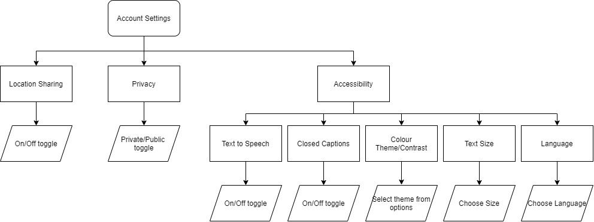

# 3. User Interface Design
This section presents the graphical user interface (GUI) for the game collection management and sourcing system, which will be implemented as a web application. This was decided following our survey, which showed that majority of players use personal computers to play games. We also considered designing a mobile application, as mobile phones were second preferred device after personal computers. However considering the time given, our primary focus will be on the web application. Our web application addresses accessibility criteria for users with disabilities and offers different language options to provide access to users from all around the world.   

## 3.1 Accessibility
We plan to implement following features to address accessibility criteria for users with different disabilities. Accessibility settings can be adjusted in the Account Settings (See Section 3.3.5).

| **Disability** | **Accessibility Feature** |
| ------ | ------ |
| Visual Impairment  | Text to Speech feature   Option to enlarge font size |
| Color Impairment | Different color palettes offered. These include: Blue/Orange, Blue/Red and White/Black | 
| Hearing Impairment | Closed captions available on all videos |

## 3.2 Design Goals and Features 
Our primary goal is to allow users to accomplish tasks in fast, easy and logical manner. To address this, we identified 3 key features, which we implemented into our UI design.

### 3.2.1 Minimalistic Design

Results from the survey suggest that most players find current game management and sourcing systems (e.g. Steam) disorganised and difficult to navigate, often displaying too much irrelevant information. Thus, we have focused on creating a minimalistic design by implementing 4 features. 

Firstly, core functionalities are organised into visible and logical units and sub-units. In this way, fewer options are displayed and users can choose which options to expand depending on their goal. For example, rather than having two separate ‘My Profile’ and ‘Account Settings’ buttons on the navigation bar, ‘Account Settings’ is placed under ‘My Profile’ option to reduce overcrowding.

Secondly, these functionality options are all presented to the user in one page, to reduce the time spent scrolling to find the functionality. This was implemented using dropdown selections. For example, rather than displaying lists of games and communities on Player Profile page, these are organised into two separate dropdown selections (‘My Games’ and ‘My Communities’), which users can click to view the lists in each section.   

Thirdly, only one navigation bar is located at the top of each page. Many game collection and sourcing websites have 3 – 4 navigation bars placed on all sides of the page, overcrowding the screen. Our web application will have one main bar at the top, which will be present in all pages. 

Lastly, our web application will use dark color palette (navy, black and dark grey) to contrast with vibrant colors of games and to reduce strains to eyes. However, other color options will also be available to take account of those with color disabilities (See Section 3.1). 

### 3.2.2 Consistent Layout

Similar layout will be maintained for all pages of the web application. This increases user’s familiarity with the application and ensures easy navigation around the website. Some consistent features include: 
* Information displayed in grey containers
* Options to edit/add/remove/submit in black buttons
* Dropdown menu options shown in grey buttons

### 3.2.3 Other features
* Texts and terminologies will use words familiar to players.
* System status messages such as ‘Game added’ or ‘Searching…’ will be displayed to help users understand the outcome of their actions and determine next tasks. 
* Options to undo or redo actions will be implemented with features such as ‘cancel’ or ‘edit’. This provides users with freedom to control their own actions and prevent errors. 
* Error messages and confirmation messages such as ‘Are you sure you want to remove this game?’ will be displayed. This ensures that irreversible errors are prevented from taking place.  

## 3.3 UI Prototype and Control Flow 
### 3.3.1 Homepage (navigation bar)

  
   

#### Purpose
* To attract and encourage users to create an account 
* To suggest games and communities 
* To display recent news, updates and feeds

#### User Interaction 
* Users can browse through game and community suggestions and feeds using the image carousel. Click on the arrows to view previous or next suggestion/feed.
* Selecting an image directs users to corresponding game and community pages.

**Navigation bar**
* Navigation bar is located at the top of every page, allowing easy navigation between different pages.
* Before signing in, users have three options in the navigation bar:
    * Home icon: directs users to homepage
    * Search icon: search tool with filters (more information below)
    * Sign-up / Log-in : a pop-up requiring users to enter valid credentials

* After signing in, users have four options in the navigation bar:
    * Home icon: directs users to homepage
    * Search icon: search tool with filters (more information below)
    * My Profile: directs users to either the player page or account settings 
    * My Communities: directs users to the community page

**Search Tool**
* Search tool has filters for the game type, rating, source of rating, and community.
* Filters can be expanded and selection can be made with tick boxes.
* Click 'GO' to make the search. 

**Feeds**
* Suggestions for communities or games are based on other games played by users with similar game/community interests.
* Publisher updates of the games, including new versions, expansion packs, convention information, or new threads from communities the user is a part of are displayed here.

#### Control Flow

### 3.3.2 Player page

  
   

#### Purpose
* To manage user's games and communities
* To display user's personal information, games, expansions, and communities to other players if privacy settings allow

#### User Interaction 
* Click on ‘Edit’ to change personal information, which is displayed for other players visiting user’s player profile.  
* For other players visiting user’s player page, personal information, games and communities are displayed without the option to edit. 
* Click on ‘My Games’ and ‘My Communities’ dropdown options to display user’s current games and communities. 
* The same UI is used for viewing other user's profile and your own (with the addition of editing functions) so users immediately understand the functionality.

**My Games dropdown**
* Games are listed and expansion packs can be displayed by expanding the list. 
* Expansion packs are selected and unselected using tick boxes. 
* Click ‘Add’ or ‘Remove’ to edit games.

**My Communities dropdown**
* User’s game communities are listed, which can be expanded to display previews of most recent feed from the community. Click ‘Expand’ to display rest of the feed.
* Clicking on the community name directs users to the corresponding community page. Click ‘Add’ or ‘Remove’ to edit communities. 

#### Control Flow

### 3.3.3 Game page

  
   

#### Purpose
* To provide basic information about the game, including ratings
* To read and write reviews from other users and from external sources
* To read and suggest rules 
* To submit questions on the game
* To provide pricing of the game from different retailers

#### User Interaction
* Click on dropdown options to view each section 

**Review dropdown**
* Users can submit their review of the game using text fields. Click ‘Submit’ to add reviews. 
* Users can scroll down to see preview of reviews and ratings from other users and from external sources. Click ‘Expand’ to view the rest of reviews. 

**Community dropdown**
* Shows preview of recent posts from the game community. 
* ‘Go To Community Page’ button directs user to the game-specific community page.  

**Rules dropdown**
* Preview of official rules are displayed. Click ‘Expand’ to view all rules. 
* Users can suggest a rule using text fields. This will be sent to the game publisher for approval. Click ‘Submit’ to add a rule. 
* Users can scroll down to preview recent updates from publishers. Click ‘Expand’ to view all updates. 

**FAQ dropdown**
* Users can post questions using text fields. Click ‘Submit’ to add a question. 
* Questions are sent to game publishers and answers are posted below the question. 
* Users can scroll down to preview FAQs from other players. Click ‘Expand’ to view the full FAQ.  

**Buy dropdown**
* Displays game price from different retailers- online and in-person.
* Click ‘Go To Website’ to redirect to retailer’s website.
* Filters for ‘Used’ and ‘New’ can be selected using tick boxes.  
* Users are free to investigate the retailers themselves which are helpfully managed in one section of this page.

#### Control Flow

### 3.3.4 Community page

  

#### Purpose
* To suggest communities and events/clubs near the user
* To find new communities and events/clubs using search tool

#### User Interaction
* There are two distinct layers to the community page- the first layer is a homepage-like interface which displays suggested discussion threads (based on your games/communities) and allows users to search for communities. The layer below this, is the game-specific community page. 
* Users can browse through community and event suggestions using image carousel. Click on the arrows to view previous or next suggestion/feed.
* Users can use search bar to find communities and events. Click ‘GO’ to make the search. 
* If user’s location is not specified, a prompt is displayed, redirecting users to account settings. 

#### Control Flow

##### Community home
The page serves the purpose of helping users navigate the communities. It is accessed from the home page by clicking on the "my communities" page. All pages are accessible through the search function and the suggested communities allows users to discover new games and conversations that similar users enjoyed.

##### Game specific community
This page hosts the discussion threads relating to specific threads, and also local clubs/events for that game. The local clubs and events are only displayed if location services have been allowed in the account settings and are displayed on an interactive map interface. The events are displayed in a calendar view. Users can comment on discussion threads for games regardless of whether they have added the game to their profile or not. This is the page users are directed to if they access a game specific community through another user's profile, or through the "suggested communities" links.

### 3.3.5 Account Settings page

  

#### Purpose
* To set location settings, privacy, accessibility, and language features to optimize the experience for each individual user.
* Language settings are particularly important as the larger the user base, the more information can be obtained to suggest relevant games/communities, and the more engagement there is with the discussion threads.
* Even with privacy set to private, users can engage with discussion threads and search for other  users, they are just not visible in search results.
* Location services are used to determine local clubs/events for the user's communities.

#### User Interaction 
* ‘Location Sharing’, ‘Privacy’, ‘Text to Speech’ and ‘Closed Captions’ can be switched on/off using toggles.
* Pop-up confirmation messages are displayed to confirm user’s action. 
* ‘Colour Theme’, ‘Text Size’ and ‘Languages’ options can be expanded and selections can be made using tick boxes. 

#### Control Flow

### 3.3.6 Publisher Interface
The idea of a separate interface for game publishers was explored, but when the technology required was discussed we concluded that we would focus on creating a slick and ergonomic interface for the players and focus our time on the one task. 

The idea was that publishers have a completely separate interface where they can read reviews posted on the website, review suggested rules or questions asked by players on the site, and choose whether to publish these on the game's page. In addition they could publish updates/bugfixes/new releases using the software which would be displayed on the main feed (homepage) of players who play that game.