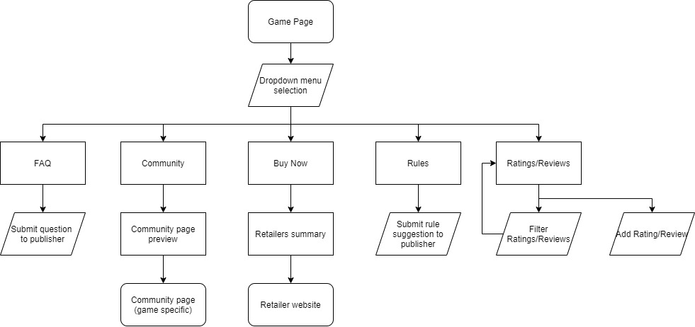
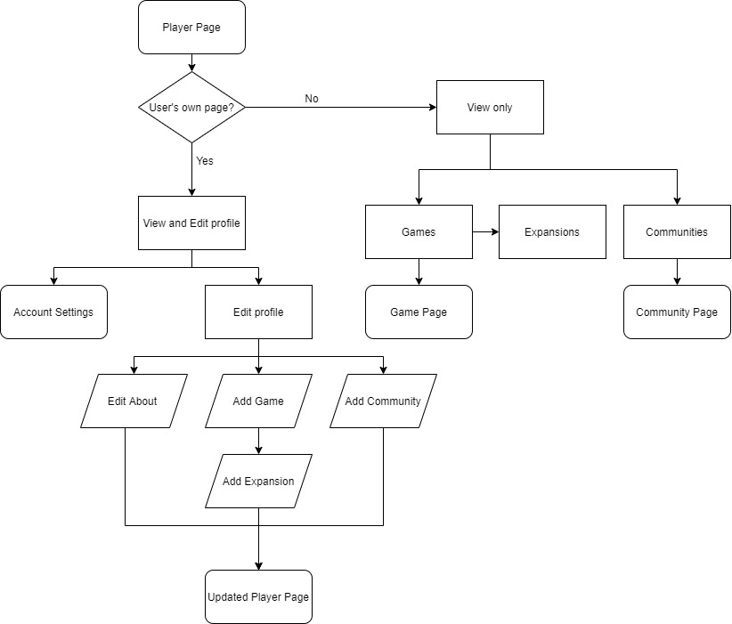
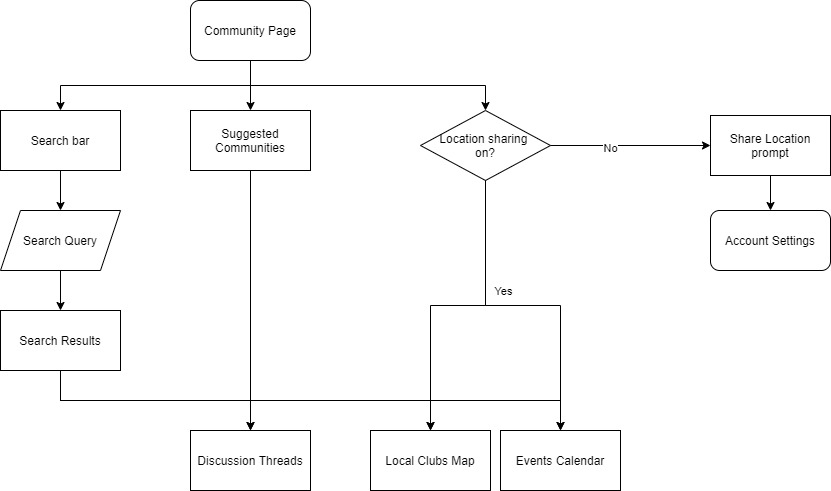
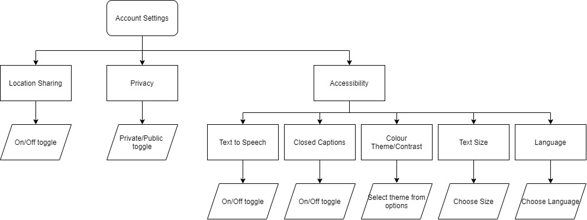

# Homepage

### Overview
The homepage is the first thing seen by the user whether they have created an account or are just browsing. There is a navigation bar with search functionality (games, players or communities), a button which redirects the user back to this homepage, and either the option to login/sign up if they have  not already, or access their own profile and communities directly.

### Searching
The search bar executes searches for game titles, other publicly viewable players, or communities for games. The search results can be filtered by type of result (game, player, community), rating (for games), or source of ratings e.g. our own users, website affiliated ratings.

### Suggestions
Suggested communities and games are displayed in the main feed in a scrolling format. These are determined from the games and communities the user already engages with on their profile and games which other users of similar tastes play. 

### Feeds
Publisher updates of the games, including new versions, expansion packs, convention information, or new threads from communities the user is a part of are displayed here.

### Sign up/Log in
The sign up/log in option prompts users to enter their email address and password. Once these are verified as either an existing account or a new one has been made, the user is granted access to their own profile.

# Game Page

### Overview
The game page holds information for each game including the rating (from our users), title, description, and images. From the game page, the user is able to access a variety of functions from the drop down menu.

### FAQ
This section holds frequently asked questions the game publisher has decided to publish. Users can ask the publisher any other queries they have directly with the submit function.

### Community
This previews a few of the most recent threads of discussion from the community page associated with the game. There is also a link which redirects the user directly to the community page for the game.

### Buy Now
Retailers (online or in person) are listed here with their price(s) and a link to their website. Since there is no platform to buy goods in our product, the users are free to investigate the retailers themselves which are helpfully managed in one section of this page.

### Rules
Similar to the FAQ section, this details publisher-approved rules for the game but allows users/players to submit rules or corrections of the game to be considered by the publisher.

### Ratings/Reviews
Ratings/reviews allow the user to see what others think of the game and also add their own review. The ratings can be filtered using the same method as in the search filters of the homepage- by source.

# Player Page

### Overview
The player page displays information on the user including a small "about" section, their games, expansions, and communities. The same UI is used for viewing your own page as when looking at someone else's, with the addition of editing functionality.

### Your profile
With your own profile, the about section can be edited, and games/communities can be added in order to personalize suggestions, and so other users can find you. The latter is only enabled if privacy settings are set to "public" in the account settings. The account settings page is accessible from your own profile only.

### Other user's profile
When viewing other user's profile, you can see games and communities they have added to their profile, and can access the associated pages directly through these links.

# Community Page

### Overview
There are two distinct layers to the community page- the first later is a homepage-like interface which displays suggested discussion threads (based on your games/communities) and allows users to search for communities. The layer below this, is the game-specific community page. 

### Community home
The page serves the purpose of helping users navigate the communities. It is accessed from the home page by clicking on the "my communities" page. All pages are accessible through the search function and the suggested communities allows users to discover new games and conversations that similar users enjoyed.

### Game specific community
This page hosts the discussion threads relating to specific threads, and also local clubs/events for that game. The local clubs and events are only displayed if location services have been allowed in the account settings and are displayed on an interactive map interface. The events are displayed in a calendar view. Users can comment on discussion threads for games regardless of whether they have added the game to their profile or not. This is the page users are directed to if they access a game specific community through another user's profile, or through the "suggested communities" links.

# Account Settings

### Overview
The account settings are accessed through your own profile and detail the privacy, location, and accessibility settings which personalise the user's experience using the software.

### Location Sharing
Location is only used to determine local clubs and events relating to games the user has searched for or is a player of. In particular, on the game-specific community page, the location is used to generate a map of the in-person clubs/meetups that are in the area.

### Privacy
This allows the user to decide whether their own profile is publicly viewable or not. If set to private, users can still comment on community discussion threads, but other users cannot view the games or communities they play. If set to public, they can appear in general searches and their information is able to be viewed by any player.

### Accessibility
Users can personalise their UI according to their personal needs in a variety of ways. these include text-to-speech, colour theme choice, and adjustable text size for users who are visually impaired and closed captions on video elements for users who are hearing impaired.

### Language
Language settings are included to ensure users from all countries and backgrounds are able to use the software. This is particularly important as the larger the user base, the more information can be obtained to use to suggest relevant games/communities, and the more engagement there is with the discussion threads.

# Publisher Interface
The idea of a separate interface for game publishers was explored, but when the technology required was discussed we concluded that we would focus on creating a slick and ergonomic interface for the players and focus our time on the one task. 

The idea was that publishers have a completely separate interface where they can read reviews posted on the website, review suggested rules or questions asked by players on the site, and choose whether to publish these on the game's page. In addition they could publish updates/bugfixes/new releases using the software which would be displayed on the main feed (homepage) of players who play that game.