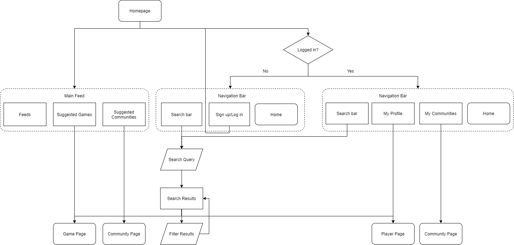

# Homepage

### Overview
The homepage is the first thing seen by the user whether they have created an account or are just browsing. There is a navigation bar with search functionality (games, players or communities), a button which redirects the user back to this homepage, and either the option to login/sign up if they have  not already, or access their own profile and communities directly.

### Searching
The search bar executes searches for game titles, other publicly viewable players, or communities for games. The search results can be filtered by type of result (game, player, community), rating (for games), or source of ratings e.g. our own users, website affiliated ratings.

### Suggestions
Suggested communities and games are displayed in the main feed in a scrolling format. These are determined from the games and communities the user already engages with on their profile and games which other users of similar tastes play. 

### Feeds
Publisher updates of the games, including new versions, expansion packs, convention information, or new threads from communities the user is a part of are displayed here.

### Sign up/Log in
The sign up/log in option prompts users to enter their email address and password. Once these are verified as either an existing account or a new one has been made, the user is granted access to their own profile.

# Game Page

### Overview

# Player Page

# Community Page

# Account Settings

# Publisher Interface
The idea of a separate interface for game publishers was explored, but when the technology required was discussed we concluded that we would focus on creating a slick and ergonomic interface for the players and focus our time on the one task. 

The idea was that publishers have a completely separate interface where they can read reviews posted on the website, review suggested rules or questions asked by players on the site, and choose whether to publish these on the game's page. In addition they could publish updates/bugfixes/new releases using the software which would be displayed on the main feed (homepage) of players who play that game.